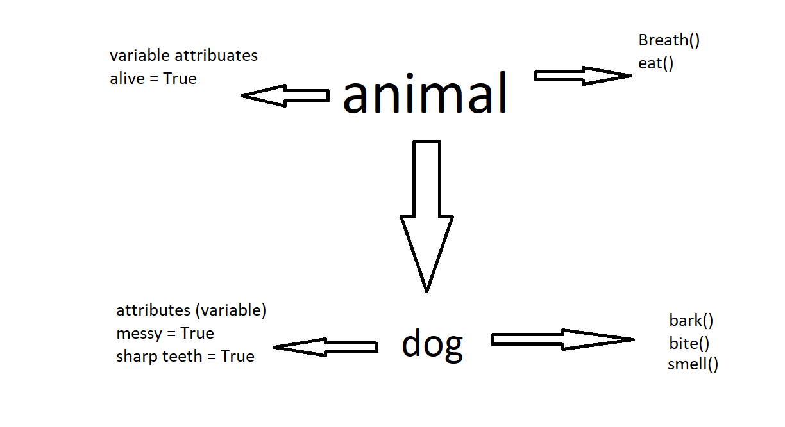

# What are OOP
OOP stand for object-oriented programming is a data structure or software design around data, similar to methods or library. 
## what are the four pillars

- Encapsulation - add security, this is where all important information is contained and only exposes some information. This is also not editable and therefore avoids unintended data corruption.
- Abstraction - Provides a way that only little information is shown to the user, hiding any unnecessary codes.
- Inheritance - it creates child or subclasses for that the data can be reused somewhere else. It makes data reusable.
- Polymorphism - its a feature that allows you to perform an action in multiple ways. It is designed to share behaviours and the program will determine which meaning or usage is necessary.

## Benefits of OOP

- code can be reuse and therefore does not need to be writen again.
 This will increase the productivity of programming
- easily upgradable or scalable due to having the functions independently. These functions can just be upgraded individually and will take effect to all programs that are using the functions and therefore don't need to go to all of them individually.
- 

